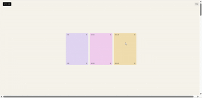

---
# **Animation with GSAP**

Smooth card animation built with HTML, CSS, and JavaScript, powered by GSAP. This project features fluid transitions as cards appear and disappear, creating a clean and modern interactive UI experience.

### Why GSAP?

GSAP is a top-tier animation library offering:

High performance with optimized rendering

Precise control over timing, easing, and sequencing

Wide browser compatibility and flexibility for complex animations

---

## **Demo**

Cards transition seamlessly in and out, demonstrating the power of GSAP for UI animations.

The layout is minimal and responsive for a clean look on various devices.

---

## **Tech Stack**

- HTML: Defines the structure of the cards and layout.

- CSS: Styles the visual design and layout for responsiveness.

- JavaScript: Works with GSAP to control animation timing, sequencing, and effects.

- GSAP (GreenSock Animation Platform): Manages smooth, performant animation sequences.

---
